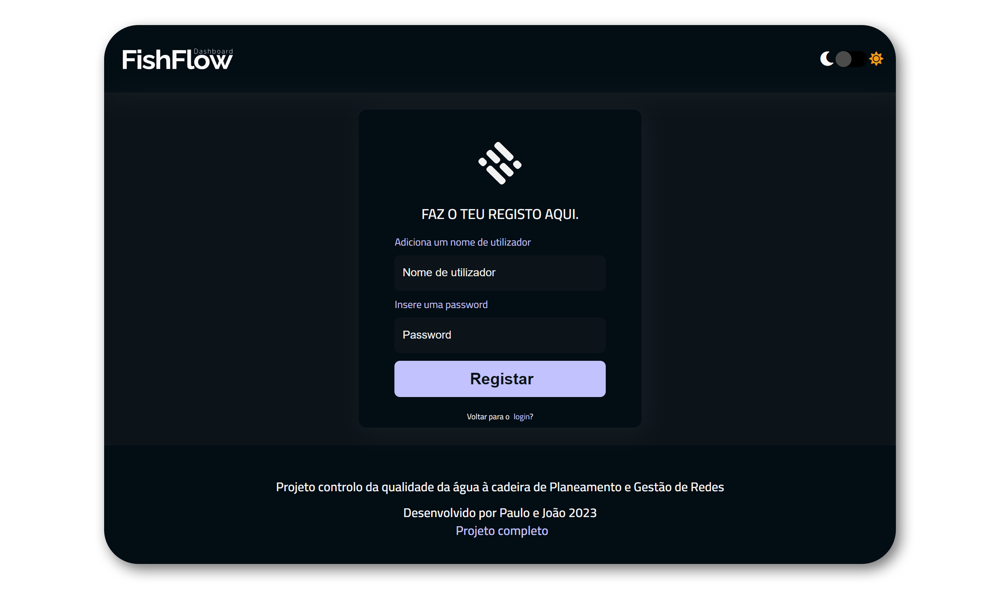
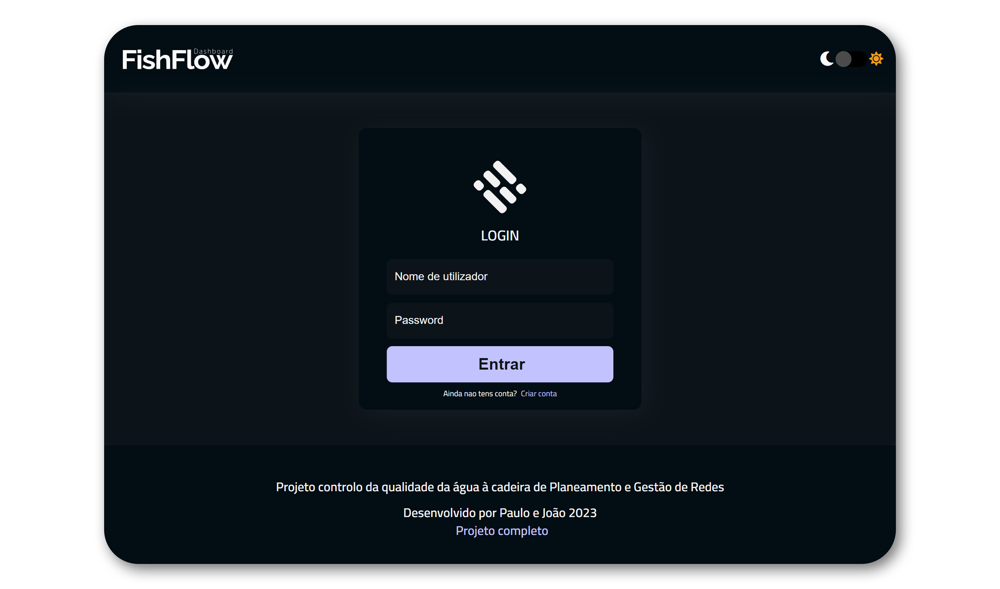
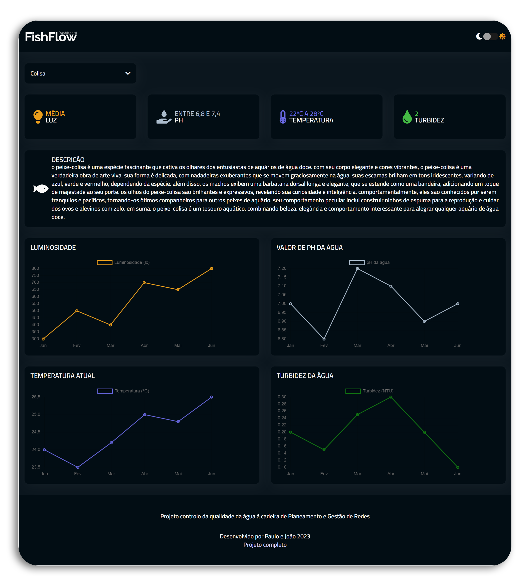
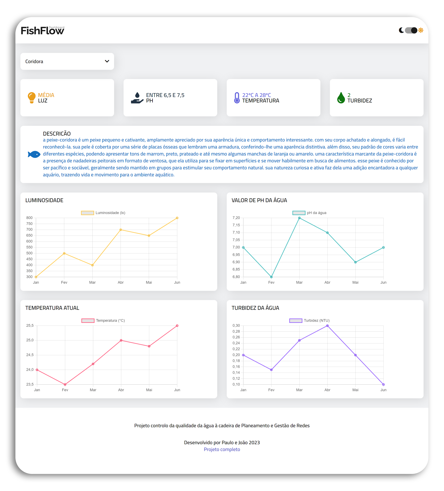

# 🚀 Plataforma de Gestão da Qualidade de Aquário

Bem-vindo ao repositório **Plataforma de Gestão da Qualidade de Aquário**! Este projeto, desenvolvido para a faculdade, é uma aplicação completa para monitorar e gerenciar a qualidade de um aquário doméstico. A plataforma inclui uma dashboard interativa que utiliza HTML, CSS, JavaScript, PHP e MySQL para registrar e verificar dados essenciais do aquário.

---

## 📚 Sobre o Projeto

A plataforma foi criada para permitir a gestão eficiente da qualidade de um aquário, monitorando diversos parâmetros como pH, temperatura, turbidez e luz. A dashboard fornece uma visão detalhada e gráfica desses dados, garantindo que as condições do aquário estejam sempre em conformidade com as necessidades específicas dos peixes que habitam o ambiente.

---

## 🛠️ Ferramentas e Tecnologias

Aqui estão as tecnologias e ferramentas utilizadas no projeto:

-   
-   
-   
-   
-   

---

## 📈 Funcionalidades

-   **Dashboard Interativa**: Interface para visualização dos dados do aquário.
-   **Gerenciamento de Dados**: Armazenamento e visualização dos dados de pH, temperatura, turbidez e luz para cada peixe.
-   **Base de Dados de Utilizadores**: Utilização de MySQL para gerir o login e registo dos utilizadores.
-   **Gráficos Dinâmicos**: Representação gráfica dos parâmetros do aquário ao longo do tempo.
-   **Verificação de Conformidade**: Sistema de monitoramento que verifica se as condições do aquário estão de acordo com as exigências dos peixes.

---

## 🎯 Objetivos do Projeto

-   Desenvolver uma **dashboard interativa** para monitoramento do aquário.
-   Gerenciar e **visualizar dados dos peixes** e das condições do aquário.
-   Implementar **gráficos dinâmicos** para análise de dados.
-   Criar um sistema de **verificação de conformidade** para garantir a qualidade do ambiente.
-   Implementar um sistema de **login e registo** de utilizadores usando MySQL.

---

## 🖼️ Interfaces

Aqui estão algumas imagens das principais interfaces da plataforma:

-   **Gestão de Utilizadores**: Permite o registo e login de utilizadores, criando contas personalizadas.

    

      
      
    

---

-   **Modo Escuro/Modo Claro**: Alterna entre modos de visualização para melhor conforto.

    

      
      
    

---

## 🔗 Links Úteis

-   [Documentação Oficial do HTML](https://developer.mozilla.org/pt-BR/docs/Web/HTML)
-   [Documentação Oficial do CSS](https://developer.mozilla.org/pt-BR/docs/Web/CSS)
-   [Documentação Oficial do JavaScript](https://developer.mozilla.org/pt-BR/docs/Web/JavaScript)
-   [Documentação Oficial do PHP](https://www.php.net/manual/pt_BR/)
-   [Documentação Oficial do MySQL](https://dev.mysql.com/doc/)

---

## 🛠️ Como Executar o Projeto

1. **Clona o repositório**: `git clone https://github.com/Pelinho03/Fish-Dashboard.git`
2. **Configura o ambiente de desenvolvimento**: Usa um servidor local como XAMPP, MAMP ou WampServer.
3. **Cria a base de dados**: Usa o MySQL para criar a base de dados de utilizadores para login e registo.
4. **Coloca os arquivos do projeto** na pasta `htdocs` do XAMPP (ou pasta equivalente em outros servidores locais).
5. **Acede à dashboard** através do navegador, navegando até `http://localhost/Fish-Dashboard/`.

---

## 🙌 Contribuições

Se tiveres sugestões ou comentários sobre o projeto, sinta-te à vontade para abrir uma **issue** ou fazer um **pull request**.

---

## 📅 Atualizações Futuras

-   [ ] Adicionar novas funcionalidades e melhorias na interface.
-   [ ] Integrar novos tipos de dados e gráficos para uma análise mais detalhada.

---

Feito por [Paulo Guimarães](https://github.com/Pelinho03)
